# 问视间 (SuperInsight) Logo 资源

## 📦 文件清单

本目录包含问视间平台的所有 Logo 变体，均为 SVG 矢量格式，可无损缩放。

### 1. **完整版 Logo** (`logo-full.svg`)
- **尺寸**: 240×80px
- **用途**: 网站顶部、官方文档、宣传材料
- **包含**: Logo 图标 + 中文名称 + 英文名称 + 标语
- **适用场景**: 
  - 网站 Header
  - PPT 封面
  - 官方文档封面
  - 宣传海报

### 2. **图标版 Logo - 64px** (`logo-icon-64.svg`)
- **尺寸**: 64×64px
- **用途**: 侧边栏、小图标、UI 组件
- **包含**: 仅 Logo 图标（包含所有设计元素）
- **适用场景**:
  - 侧边栏展开状态
  - 按钮图标
  - 卡片头部
  - 通知消息

### 3. **图标版 Logo - 128px** (`logo-icon-128.svg`)
- **尺寸**: 128×128px
- **用途**: 中等尺寸展示
- **包含**: 仅 Logo 图标（包含所有设计元素）
- **适用场景**:
  - 应用商店图标
  - 桌面快捷方式
  - 移动端应用图标
  - 社交媒体头像

### 4. **简化版 Logo** (`logo-simple-48.svg`)
- **尺寸**: 48×48px
- **用途**: 收起的侧边栏、Favicon
- **包含**: 简化版图标（圆角矩形背景 + W 形状 + 数据点）
- **适用场景**:
  - 侧边栏收起状态
  - 浏览器标签页小图标
  - 移动端顶部栏
  - 紧凑型 UI

### 5. **横向版 Logo** (`logo-horizontal.svg`)
- **尺寸**: 320×64px
- **用途**: 横向布局场景
- **包含**: Logo 图标 + 完整文字（横向排列）
- **适用场景**:
  - 登录页面
  - 横幅广告
  - 邮件签名
  - 横向布局页面

### 6. **Favicon** (`logo-favicon.svg`)
- **尺寸**: 32×32px
- **用途**: 浏览器标签页图标
- **包含**: 极简版图标（圆角矩形背景 + W + 数据点 + AI 点）
- **适用场景**:
  - 浏览器标签页
  - 书签图标
  - PWA 应用图标
  - 最小化图标

### 7. **方形版 Logo - 256px** (`logo-square-256.svg`)
- **尺寸**: 256×256px
- **用途**: 高清展示、应用商店
- **包含**: Logo 图标 + 底部文字
- **适用场景**:
  - 应用商店大图
  - 产品展示页
  - 高清打印
  - 社交媒体封面

---

## 🎨 Logo 设计元素

### 核心元素（7个）
1. **渐变背景圆形** - 品牌色渐变 (#1890FF → #096DD9)
2. **数据网格** - 7条交叉线，象征结构化数据
3. **"W" 品牌形状** - 代表"问视间 (Wins)"
4. **数据点高亮** - 3个白色圆点 + 发光效果
5. **标注标签图标** - 绿色渐变标签，核心业务标识
6. **数据流曲线** - 3条波浪线，表示数据处理流程
7. **AI 指示点** - 3层同心圆 + 紫色，代表 AI 能力

### 颜色系统
- **主品牌色**: #1890FF (蓝色)
- **深品牌色**: #096DD9 (深蓝)
- **强调色**: #52C41A (绿色)
- **深强调色**: #389E0D (深绿)
- **AI 色**: #722ED1 (紫色)
- **高光色**: #FFFFFF (白色)

---

## 📏 使用规范

### 最小尺寸
- **完整版**: 最小宽度 180px
- **图标版**: 最小尺寸 32×32px
- **简化版**: 最小尺寸 24×24px
- **Favicon**: 固定 32×32px 或 16×16px

### 留白空间
- Logo 周围至少保留 Logo 高度 1/4 的留白空间
- 不要在 Logo 周围放置其他干扰元素

### 禁止操作
❌ 不要改变 Logo 颜色  
❌ 不要拉伸变形 Logo  
❌ 不要添加阴影或特效  
❌ 不要旋转 Logo  
❌ 不要分离 Logo 元素  
❌ 不要在复杂背景上使用  

### 推荐操作
✅ 保持原始宽高比  
✅ 使用纯色背景  
✅ 在深色背景上使用明亮主题  
✅ 在浅色背景上使用默认主题  
✅ 保持清晰可辨识  

---

## 🔧 技术规格

### 文件格式
- **格式**: SVG (Scalable Vector Graphics)
- **优点**: 
  - 矢量格式，无损缩放
  - 文件体积小
  - 支持动画和交互
  - Git 友好（文本格式）

### 浏览器兼容性
- ✅ Chrome 90+
- ✅ Firefox 88+
- ✅ Safari 14+
- ✅ Edge 90+
- ✅ 移动端浏览器

### 导出建议
如需导出为位图格式（PNG）：
- **低分辨率**: 1x (72 DPI)
- **标准分辨率**: 2x (144 DPI)
- **高分辨率**: 3x (216 DPI)
- **打印质量**: 300 DPI

---

## 💼 使用场景示例

### Web 开发
```html
<!-- 完整版 Logo -->


<!-- 图标版 Logo -->


<!-- Favicon -->
<link rel="icon" type="image/svg+xml" href="/logos/logo-favicon.svg" />
```

### React 组件
```tsx
import LogoFull from '/logos/logo-full.svg';
import LogoIcon from '/logos/logo-icon-64.svg';

function Header() {
  return (
    <header>
      
    </header>
  );
}
```

### CSS 背景
```css
.logo-bg {
  background-image: url('/logos/logo-icon-128.svg');
  background-size: contain;
  background-repeat: no-repeat;
}
```

---

## 📱 响应式建议

### 桌面端
- Header: 使用 `logo-full.svg` 或 `logo-horizontal.svg`
- 侧边栏展开: 使用 `logo-icon-64.svg` 或 `logo-icon-128.svg`
- 侧边栏收起: 使用 `logo-simple-48.svg`

### 平板端
- Header: 使用 `logo-horizontal.svg`
- 侧边栏: 使用 `logo-icon-64.svg`

### 移动端
- 顶部栏: 使用 `logo-simple-48.svg` 或 `logo-icon-64.svg`
- 启动页: 使用 `logo-square-256.svg`

---

## 🎯 品牌应用

### 官方渠道
- 官网: logo-full.svg
- 移动应用: logo-square-256.svg
- 社交媒体: logo-icon-128.svg
- 文档站点: logo-horizontal.svg

### 宣传材料
- 海报: logo-full.svg 或 logo-square-256.svg
- 名片: logo-simple-48.svg 或 logo-icon-64.svg
- PPT: logo-horizontal.svg
- 视频封面: logo-square-256.svg

### 数字产品
- 桌面应用: logo-square-256.svg
- 移动应用: logo-square-256.svg
- 浏览器扩展: logo-icon-128.svg
- PWA 应用: logo-favicon.svg + logo-square-256.svg

---

## 📄 许可证

© 2025 问视间 (SuperInsight) Team. All rights reserved.

这些 Logo 资源仅供问视间项目官方使用。未经授权，不得用于其他用途。

---

## 📞 联系方式

如需更多 Logo 变体或定制需求，请联系：
- 邮箱: design@superinsight.example.com
- 设计团队: SuperInsight Design Team

---

## 🔄 更新日志

### v2.6.2 (2025-02-26)
- ✅ 创建完整的 Logo 资源包
- ✅ 7 种规格的 SVG 文件
- ✅ 完整的使用文档
- ✅ Git 友好的矢量格式

### v2.6.1 (2025-02-26)
- ✅ Logo 全面升级
- ✅ 7 个核心设计元素
- ✅ 5 种动画效果

### v2.6.0 (2025-02-26)
- ✅ 初始 Logo 设计
- ✅ 基础品牌视觉

---

<div align="center">
  
  <p><strong>数据标注，智见未来</strong></p>
  <p>Data Annotation, Intelligent Insight</p>
</div>
